# Kế hoạch Phân rã Công việc (Work Breakdown Structure - WBS)
**Dự án:** Security Tools (HQC System MVP)

Bản kế hoạch này chia dự án Thành 5 Giai đoạn (Phases) cốt lõi dựa trên tài liệu PRD và Yêu cầu Hệ thống.

## 📊 Sơ đồ WBS (Work Breakdown Structure)

```mermaid
graph TD
    Root["HQC Security Tools (MVP)"]
    
    Phase1["Phase 1: Foundation & Architecture<br>(Thiết lập cốt lõi)"]
    Phase2["Phase 2: Identity & Workspace<br>(Quản trị dự án)"]
    Phase3["Phase 3: Core Scan Engine<br>(Động cơ dò quét)"]
    Phase4["Phase 4: Extra Modules<br>(Scan nâng cao)"]
    Phase5["Phase 5: Reporting<br>(Báo cáo)"]

    Root --> Phase1
    Root --> Phase2
    Root --> Phase3
    Root --> Phase4
    Root --> Phase5

    Phase1 --> P1_1["1.1 Khởi tạo Maven Multi-module"]
    Phase1 --> P1_2["1.2 Thiết lập Flyway & Database"]
    Phase1 --> P1_3["1.3 Global Error Handling & Config"]

    Phase2 --> P2_1["2.1 Auth/User Management"]
    Phase2 --> P2_2["2.2 Projects Management"]

    Phase3 --> P3_1["3.1 Scan Job Orchestrator"]
    Phase3 --> P3_2["3.2 Asset Discovery (Crawler)"]
    Phase3 --> P3_3["3.3 Payload Engine Framework"]
    Phase3 --> P3_4["3.4 Web Vulnerability Scanner"]

    Phase4 --> P4_1["4.1 API Swagger Scanner"]
    Phase4 --> P4_2["4.2 Dependency/SAST Scanner"]

    Phase5 --> P5_1["5.1 Tổng hợp Vulnerability Results"]
    Phase5 --> P5_2["5.2 Xuất Báo cáo (PDF/Excel)"]
    Phase5 --> P5_3["5.3 Webhook & CI/CD Integrations"]

    classDef phase fill:#2d3748,stroke:#4a5568,color:#fff,stroke-width:2px,rx:5px,ry:5px;
    classDef root fill:#4299e1,stroke:#2b6cb0,color:#fff,stroke-width:3px,rx:10px,ry:10px,font-weight:bold;
    classDef task fill:#edf2f7,stroke:#cbd5e0,color:#2d3748,stroke-width:1px,rx:5px,ry:5px;
    
    class Root root;
    class Phase1,Phase2,Phase3,Phase4,Phase5 phase;
    class P1_1,P1_2,P1_3,P2_1,P2_2,P3_1,P3_2,P3_3,P3_4,P4_1,P4_2,P5_1,P5_2,P5_3 task;
```

---

## 📝 Danh sách Tasks Chi Tiết (Backlog)

### Phase 1: Foundation & Architecture (Thiết lập Nền tảng)
> Mục tiêu: Đặt nền móng vững chắc với cấu trúc Hexagonal, chuẩn bị database và container sẵn sàng cho việc code logic.
- [ ] **1.1 Khởi tạo Dự Án Chứa:** Tạo `parent-pom` và phân chia module rỗng: `common`, `api`, `application`, `domain`, `infrastructure`, `scan`, `crawler`.
- [ ] **1.2 Database Migration:** Cấu hình thư viện Flyway, viết script `V1__init_schema.sql` khởi tạo bảng (`users`, `projects`, `scan_jobs`, `endpoints`,...).
- [ ] **1.3 Common & Security Bootstrapping:** Thiết lập `GlobalExceptionHandler`, base `ErrorResponse`, config auth sơ cấp và cấu hình Docker Compose cho PostgreSQL local/Testcontainers.

### Phase 2: Identity & Workspace (Quản trị Người dùng & Dự án)
> Mục tiêu: Data gốc của ứng dụng, cần thiết lập trước để các module phía sau có project_id để liên kết.
- [ ] **2.1 Users & Roles:** API rỗng/logic cơ bản về quản lý Account theo quyền Dev/Tester/Admin.
- [ ] **2.2 Workspaces (Projects):** Logic CRUD dự án (nơi chứa các target url, scan job).

### Phase 3: Core Scan Engine (Động cơ Dò quét)
> Mục tiêu: Lõi kiến trúc của Tool, chia logic scan làm nhiều sub-module giao tiếp với nhau.
- [ ] **3.1 Job Orchestrator:** Điều phối `scan_jobs` (State machine chuyển trạng thái: Pending -> Running -> Done).
- [ ] **3.2 Asset Discovery (Crawler):** Nhận 1 seed Taret URL $\rightarrow$ Crawl ra một sơ đồ link/form/endpoints.
- [ ] **3.3 Payload Engine:** Thư viện payload nhúng lỗ hổng tự động giả lập XSS, SQLi... đổi biến theo HTTP method.
- [ ] **3.4 Web Vulnerability Scanner:** Logic vòng lặp map Payload vào Endpoint $\rightarrow$ Call HTTP $\rightarrow$ Bắt Response $\rightarrow$ Ghi lỗi `vulnerabilities` vào cơ sở dữ liệu.

### Phase 4: Extra Scanners (Các Plugin Quét Bổ sung)
> Mục tiêu: Mở rộng các hướng quét khác cho Security.
- [ ] **4.1 API Security Testing:** Parse Swagger/OpenAPI, test missing auth và test endpoints phi logic.
- [ ] **4.2 Code & Dependencies Checks:** Scan phiên bản phần mềm (gọi dependency checker).

### Phase 5: Reporting & Post-Scan (Báo cáo Hệ thống)
> Mục tiêu: Hiển thị kết quả ra giao diện.
- [ ] **5.1 Report Aggregation API:** Tổng hợp các data lỗi thành 1 response dashboard.
- [ ] **5.2 Export Module:** Parse JSON xuất thành file PDF / Excel báo cáo chi tiết các bước reproduce.
- [ ] **5.3 CI/CD Integration:** Endpoint webhook dành cho Jenkins/Gitlab móc vào gọi lệnh chạy CI, fail build tùy theo mức rủi ro.
